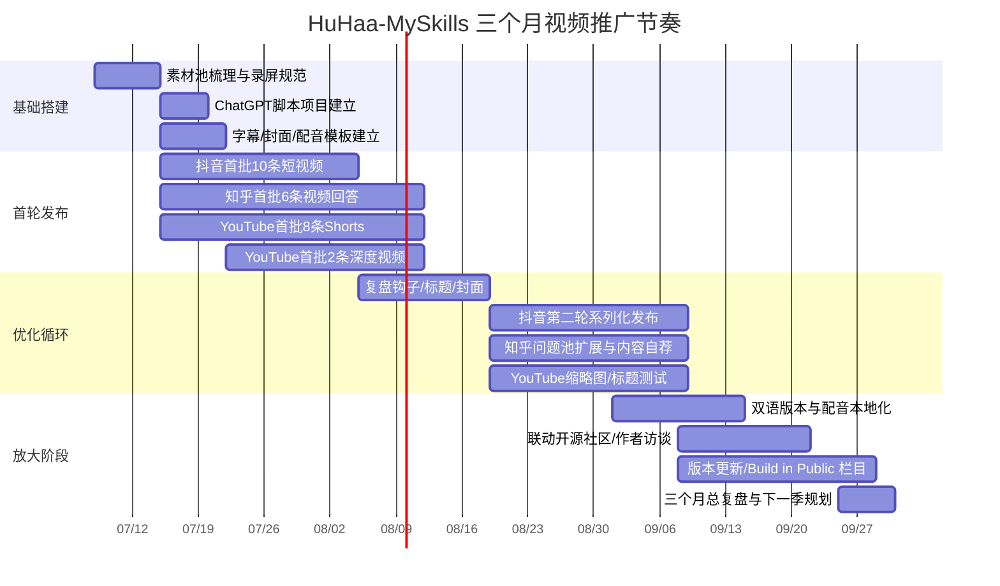

# HuHaa-MySkills 三平台 AI 视频推广深度研究方案

## 执行摘要

HuHaa-MySkills 的公开定位很清晰：它是一个面向 AI agent workflows 的本地技能、插件与 MCP 聚合中枢；仓库内现有 160+ `SKILL.md` 文件、`/api/other-skills` 与 `/api/icons/:brand` 两类核心接口、真实图标提取与缓存逻辑、搜索/排序/分组式前端呈现，以及响应式的仪表盘与列表-详情双栏 UI。仓库公开页显示其最新版本为 `v0.3.7`，发布日期为 2026 年 7 月 7 日；当前公开社交证明仍偏弱，Star 仅 1、Fork 0、但已有 24 个 release，这意味着推广策略不应该依赖“社区已爆火”的社会证明，而应依赖“真实可验证的功能演示”与“问题—解决方案—结果”的视频叙事。citeturn2view0turn3view0turn24view0

从平台机制看，三平台最优打法并不相同。抖音更适合高频、竖屏、强钩子、强字幕、强封面的结果型短视频；知乎更适合“围绕问题”的解释型视频回答，重点是绑定合适话题、避免标题党、强调可信来源与问题解法；YouTube 则应该采用“双轨制”——用 Shorts 做冷启动获客，用 16:9 深度教程做搜索与长期流量沉淀，并通过自定义缩略图、字幕、多语言音轨、Analytics 与 A/B 测试持续优化。抖音官方创作者服务平台强调内容管理、互动管理与数据管理；知乎官方手册强调“不要浪费标题及开头”“绑定合适的话题”“引用可信来源”；YouTube 官方则明确强调首 1–2 秒抓人、标题简明准确、缩略图简洁可读、以及通过 CTR 与 retention 评估包装与内容表现。citeturn10search2turn10search5turn28view0turn19search0turn4search11turn5search12turn0search16turn11search11turn11search17

对这个项目最有效的内容母题，不是“我做了个仓库”，而是三类用户痛点：第一，**Agent 技能分散、插件碎片化、MCP 入口难管理**；第二，**本地技能目录与工具图标信息不统一，难以浏览和检索**；第三，**开发者需要一个本地、可扩展、面向 workflow 的技能中枢，而不是又一个聊天壳**。这些母题与仓库当前的已实现特性高度对应，包括通用扫描器、按需提取真实图标、搜索/过滤/排序/分组式前端，以及“Official Tools / Custom Skills / Other Sources”的分类视图升级。citeturn3view0turn25view0turn25view1

在制作方式上，最推荐的不是“全 AI 生成视频”，而是“**真实仓库演示为主，AI 负责加速包装**”。原因很简单：与你的项目目标用户高度重合的开发者群体，更信任真实 CLI、真实 API、真实 UI、真实 release 轨迹，而不是纯 CG 演绎。AI 最适合用在脚本拆解、镜头联想、双语配音、字幕翻译、节奏化剪辑、封面/缩略图设计与多版本 A/B 包装上。OpenAI 的 Projects 很适合作为长期脚本工作区，GPT Image 可用于封面与缩略图草图；ElevenLabs 适合中英配音与配音本地化；Runway 适合短 B-roll、转场与角色化演绎；CapCut 适合自动字幕、翻译、样式化与社媒导向的快速剪辑；YouTube 则原生支持字幕、多语言音频、Analytics 与“标题/缩略图测试与对比”。citeturn20search2turn20search5turn20search3turn20search12turn21search2turn21search5turn21search9turn21search17turn21search0turn21search7turn22search2turn22search4turn22search6turn22search18turn11search0turn11search4turn11search6turn4search7turn11search3

三个月内，推荐采用“**一套素材、三种包装、两种语言、一个指标树**”的打法：每周先产出 1 个“主演示视频母版”，再裁成抖音 15–45 秒竖屏版、知乎 60–180 秒问题解释版、YouTube Shorts 30–60 秒发现版与 YouTube 4–8 分钟深度版。以“视频表现指标 + GitHub 转化指标”双层评估：前者看播放、完播/留存、互动，后者看 repo 点击、release 点击、star、issue/discussion 增量。由于你没有给出具体工具预算，本报告按“无特定预算约束”的前提设计，以低成本可落地、可逐步升级为原则。citeturn10search2turn27search0turn11search7turn11search11

## 项目诊断与传播定位

HuHaa-MySkills 在传播上最需要解决的，不是“如何更酷”，而是“如何用 5 秒让目标用户明白它是什么”。从 README 与前端规范看，项目的可演示卖点至少有六个：本地技能/插件/MCP 聚合定位；递归扫描 160+ `SKILL.md`；`/api/other-skills` 返回真实数据并注入 icon 字段；`/api/icons/:brand` 按需提取真实图标 PNG 并缓存；前端支持搜索/排序/分组与响应式双列布局；以及围绕 dashboard、skills source、tier 分类与 settings 的结构化 UI。citeturn3view0turn24view0turn25view0turn25view1

这意味着视频叙事不应从“介绍项目名”开始，而应从“展示真实问题”开始。对中文平台，我建议第一钩子统一用下面三类句式之一：  
“Agent 技能散一地，怎么统一管理？”  
“160+ 本地技能文件，怎么变成一个能搜、能筛、能看图标的中枢？”  
“不是聊天壳，这是给 AI workflow 用的技能聚合层。”  
这些钩子都能直接映射到仓库当前已实现内容，不会产生“标题太大、演示太弱”的错配。citeturn3view0turn25view0

就受众而言，项目最匹配的不是泛 AI 娱乐人群，而是四类相对明确的人群。第一类是中国区 AI 工作流玩家，已经在看 Dify、n8n、Coze、MCP、本地模型、Open WebUI 之类内容；第二类是独立开发者与工具作者，关注本地优先、可扩展、可解释的 agent 工具链；第三类是正在搭建个人 AI 操作系统的人，他们会对“技能目录、插件入口、图标、来源、结构化管理”高度敏感；第四类是国际 YouTube 侧的 self-hosting / workflow automation 观众，他们通常通过教程、演示与对比搜索发现新项目。抖音与 YouTube 上 Dify、n8n、Open WebUI、ComfyUI 等开源工具类视频的高密度出现，说明这类受众已经形成稳定消费习惯。citeturn13search0turn29search5turn29search9turn32search1turn32search8turn32search34turn32search35

因此，HuHaa-MySkills 的传播定位应当是：**给 AI agent workflow 用户看的“本地技能中枢工具”**，而不是泛泛的“AI 项目介绍”。具体传播语可以分别本地化为：

中文主定位：  
**“把散落在本地、插件与 MCP 里的能力，聚合成一个可搜索、可筛选、可扩展的 AI 技能中枢。”**

英文主定位：  
**“A local skills, plugins, and MCP aggregation hub for AI agent workflows.”**  
这一定义本身就来自仓库公开 About 描述，因此它适合作为 YouTube 频道 About、视频描述第一句与英文配音的固定句。citeturn2view0

还需要特别指出一个现实判断：由于仓库当前公开 Star 数很低，但 release 节奏明确，推广初期不要把“Star 数”做成主要封面大字，而要把“真实功能证据”做成封面主视觉：例如 UI、API 返回、图标提取、搜索过滤前后对比、分类层级等。你不是在卖热度，而是在卖可信度。等到后续 community signal 足够后，再把 “v0.3.7 / 24 releases / 新增功能” 升级为第二层传播资产。citeturn2view0turn3view0

## 平台策略对比

下表先给出一张可直接执行的三平台战术总览。需要强调的是：YouTube 有公开、明确、细颗粒度的官方创作者文档；知乎公开文档更强调内容形态、话题绑定、开头与可信来源；抖音公开到搜索引擎的官方信息更多集中于创作者服务平台描述、AI 标识规范以及大会上的推荐逻辑表述。因此，抖音与知乎部分的“最佳长度/比例”是**运营建议**，不是我找到的硬性官方规格。citeturn10search2turn34search4turn28view0turn19search6turn12search2turn0search16turn11search0

| 维度 | 抖音 | 知乎 | YouTube |
|---|---|---|---|
| 内容主形态 | 竖屏结果型短视频；先结果再原理 | 问题驱动的视频回答/解释型 demo | Shorts 负责发现，16:9 深度教程负责搜索与沉淀 |
| 建议时长 | 15–45 秒主力；45–90 秒用于“一个功能一步演示” | 60–180 秒回答型演示；3–8 分钟用于完整解法 | Shorts 30–60 秒最稳；官方支持最长 3 分钟竖屏 Short；深度视频 4–10 分钟起 citeturn12search0turn12search2turn12search7 |
| 画幅建议 | 9:16 为主；封面与字幕按竖屏安全区设计，抖音搜索内容也大量围绕 9:16 封面制作展开 citeturn26search1turn26search7 | 官方公开指导未给出单一强制比例；建议优先 16:9 解释型母版，再切 9:16 试分发，因知乎更重“问题解答”场景而非纯刷屏场景 citeturn28view0turn19search6 | Shorts 为竖屏或方形且 3 分钟内；长视频用 16:9；可自定义缩略图 citeturn12search2turn11search18 |
| 字幕/说明 | 强烈建议烧录中文字幕；首屏就给“大字钩子” | 中文字幕 + 术语解释更重要；正文/描述补来源 | 原生字幕、上传字幕文件、自定义多语言字幕与音轨最完整 citeturn11search0turn11search4turn11search6 |
| 封面/缩略图 | 竖屏封面，大字少字、高对比、前 2 秒就看懂 | 题目化封面：问题 + 结论 + 证据感 | 官方强调标题准确、简洁；缩略图简洁、可读、贴近目标受众；支持测试与对比 citeturn5search12turn0search16turn4search7 |
| 发帖节奏 | 建议每周 4–6 条；冷启动期至少 3 条 | 建议每周 2–3 条视频回答，搭配 3–5 条图文/回答互相导流 | 建议每周 2–3 条 Shorts，隔周 1 条深度视频 |
| 关键词/话题 | 以“问题词 + 工具词 + 场景词”为主，如 #AI工作流 #MCP #本地部署 #GitHub | 绑定合适话题极其关键；问题标题、开头、话题决定流通质量 citeturn28view0turn19search0turn19search6 | 关键词放标题前半，标签做补充；搜索型标题与好奇型标题可并行测试 citeturn5search12turn11search3 |
| 推荐机制抓手 | 优质内容池、垂类匹配、真实有用内容、AI 使用增长；创作者中心有内容/互动/数据管理 citeturn33search0turn33search8turn10search2 | 在问题、关注、推荐三套流通里拿到位置；不要浪费标题与开头；绑定合适话题；可信来源增强传播 citeturn27search2turn19search0turn28view0 | 前 1–2 秒钩子、CTR、retention、watch time 是关键；YouTube 可直接看 reach/engagement 数据 citeturn4search11turn11search7turn11search11turn11search17 |
| 受众打法 | 中国区 AI 工具/工作流/本地部署用户 | “有具体问题要解决”的知识型用户 | 全球 self-hosting / automation / open-source / AI tooling 观众 |
| CTA | 评论区关键词领取模板、主页置顶仓库、收藏+私信 | “附仓库/命令/API 说明见文末”，引导到回答/专栏/置顶评论 | 描述区 repo 链接、置顶评论、end screen、订阅与星标双 CTA citeturn11search16 |
| 本地化 | 全中文口播与字幕；英文 repo 名不翻 | 中文为主，术语中英双写 | 英文口播 + 中文字幕；热门视频再做中文配音轨/字幕 citeturn11search14turn11search4 |
| KPI | 推荐流量占比、3 秒停留、完播、收藏、私信/评论关键词回复数 | 推荐/关注流通、打开率、平均播放时长、赞同/收藏/评论、内容自荐后增量 | Impressions、CTR、average view duration、retention、subs、repo 点击率、标题/缩略图测试结果 citeturn10search2turn27search0turn11search3turn11search7turn11search13 |

围绕这个表，我的策略结论很明确。抖音不适合你一开始讲太多工程背景，应该先丢出“痛点 + 结果”——例如“160+ 本地技能文件，30 秒聚成一个面板”；知乎要把项目包装成“回答问题的工具”，例如“如何把散落在本地与 MCP 的 agent 能力整理成可检索中枢”；YouTube 则最适合建立系列栏目，如 “Build in Public: HuHaa-MySkills”、“Why local skills hubs matter for agent workflows”、“From SKILL.md to searchable dashboard”。citeturn28view0turn19search0turn4search11turn0search16

下面这两个自制示意图，可以直接拿来作为封面/分镜的母版。

### 缩略图与封面示意

```text
抖音 9:16 封面
┌────────────────────┐
│  顶部钩子：        │
│  Agent技能太散？   │
│                    │
│  中部主视觉：      │
│  仓库UI截图 + 图标 │
│  搜索框/分类栏     │
│                    │
│  底部证据：        │
│  160+ SKILL.md     │
│  本地聚合中枢      │
└────────────────────┘
```

```text
YouTube 16:9 缩略图
┌──────────────────────────────────────┐
│  左：搜索/过滤前后对比               │
│  右：HuHaa-MySkills UI 截图          │
│  大字：Turn Local Skills Into a Hub  │
│  小字：Plugins · MCP · SKILL.md      │
└──────────────────────────────────────┘
```

这些视觉方案之所以有效，不是因为“好看”，而是因为它们把平台官方反复强调的几个变量对齐了：首屏可理解、标题/缩略图简洁准确、与内容强相关、优先服务目标受众。citeturn28view0turn4search3turn0search16

## 平台案例研究

### 抖音案例

抖音上的可比案例，最强的共性不是“剪得很炫”，而是**第一秒就说出工具名、痛点或结果**，并把“教程/开源/GitHub/本地部署/工作流”这类高意图词堆到标题与画面里。尤其是工具类视频，经常不追求叙事完整，而追求“立刻让懂的人停下来”。citeturn13search0turn29search5turn29search9

| 示例 | 可比性 | 可见信号 | 你应借鉴的点 | 来源 |
|---|---|---:|---|---|
| 最强开源 AI 工作流 n8n，上千插件+模板 | 开源工作流工具推广 | 明确显示“点赞 3.1 万” | 超强标题 + GitHub/social proof + “完整教程”承诺极强；非常适合你的“核心功能总览”视频 | citeturn13search0 |
| Introducing Dify Workflow | 类产品功能介绍 | 页面展示四项互动计数 25/1/28/12 | 双语产品名 + 极短产品介绍；适合做“新功能更新”类短片 | citeturn13search4 |
| 一个开源项目，把 AI 助手变成 AI 团队 | 开源 agent 框架推广 | 页面可见项目 star 暴涨叙述 | “问题—转折—项目出现—三步上手—快去点 star”是很强的抖音模板 | citeturn13search7 |
| 本地部署大模型的 Open-WebUI 框架介绍 | 本地 AI 前端/中枢类 | 页面显示 782 等互动数字 | “一套工具就足够”“支持千种模型”等单句价值钉住用户，适合你做价值定义片 | citeturn29search9 |
| Open-WebUI + MCP 企业级接入流程 | 与 HuHaa 的 MCP 聚合诉求高度接近 | 页面显示 745 | 标题里直接写出“企业级”“MCP”“流程详解”，非常适合中高意图用户筛选 | citeturn14search11 |
| Dify 工作流一键生成图表数据可视化 | 工作流结果演示 | 页面显示 1802 | “一键生成 + 可见结果”是工具视频的高效打法；你可以改成“一键聚合/一键检索” | citeturn29search5 |
| Dify 制作 PPT 效果如何 | 系列化教程 | 页面展示 174/7/142/19 | 使用 Vol. 编号做系列栏目，让用户理解这是连续更新而非随手一发 | citeturn29search5 |
| 这是一个能够让 AI 制作视频的开源项目 Hyperframes | 开源项目快讯 | 时长 00:34，页面另见“37”互动数字 | 34 秒超短快讯证明：抖音可以只讲“这是什么 + 有什么用 + 去哪看” | citeturn29search7 |
| 如何将 GitHub 项目喂给 AI | GitHub + AI 项目快讯 | 标题直接绑定 GitHub 爆火 | 适合你做“这类仓库为什么值得试”的信息流快报型内容 | citeturn29search0 |
| dify 各个平台的图文创作 / 工作流 | 跨平台内容自动化 | 页面展示 45/14 等数字 | 抖音用户对“一个工具服务多个平台”的母题很敏感，这与你的跨平台推广目标契合 | citeturn29search14 |

从这些案例反推，抖音对你最有效的四种视频模板应当是：  
**快讯型**：15–25 秒，讲“新功能/新 release/为什么值得试”；  
**结果型**：20–40 秒，只演示一个可见结果，比如“搜索+图标+分类一屏看完”；  
**对比型**：25–45 秒，讲“散乱技能目录 vs 统一中枢”；  
**系列型**：40–90 秒，按“Vol.001 安装、Vol.002 扫描、Vol.003 图标、Vol.004 MCP 分类”连载。以上判断直接来自可比案例在标题、时长、互动结构上的共同模式。citeturn13search0turn13search7turn29search5turn29search7

抖音上还必须补一个合规点：如果你使用了明显的 AIGC 角色、配音或生成画面，平台已有 AI 内容显著标识与元数据识别机制，创作者应主动标识 AI 生成内容；平台也会在必要场景给出“作品含 AI 生成内容”之类提示。与此同时，平台公开表述也说明，推荐更偏向“有温度、有干货、有实实在在的内容”，而不是单纯噱头。对你这种开源项目来说，这反而是利好。citeturn34search4turn34search3turn33search8

### 知乎案例

知乎的传播逻辑与抖音差别最大。知乎官方公开手册反复强调：创作形态多样，但新人更适合优先参与问答；标题和开头不要浪费；要绑定合适的话题；要提供可信来源；要减少标题党、营销导流与答非所问。官方关于视频回答的说明还明确了视频可以通过“关注”“推荐”与绑定问题额外流通；在目标问题下用“写回答 → 视频回答”创建时，没有时长限制。citeturn28view0turn27search2turn19search0turn19search6

这决定了知乎上不应该直接搬抖音视频，而要把项目重新包装成“一个问题的答案”。你的视频不是在卖产品，而是在回答：  
“如何整理本地 AI 技能资产？”  
“如何让 agent workflow 的技能来源更可检索？”  
“为什么本地 skill/plugin/MCP 聚合层很重要？”  
这类问题与知乎的分发语义更匹配。citeturn28view0turn27search2

| 示例 | 内容类型 | 可见信号 | 你应借鉴的点 | 来源 |
|---|---|---:|---|---|
| 在 Dify 轻松调用顶尖开源与国产模型 | 专栏/功能解读 | 明确是“轻松调用 + 开源/国产模型” | 标题把“要解决的能力”写清楚，而非只写产品名 | citeturn15search1 |
| 构建你的第一个 AI 视频生成工具（使用 ComfyUI） | 教程型长文/项目教学 | 2025-07-01 | “构建你的第一个……”是典型的知乎学习型标题，适合 HuHaa 初体验系列 | citeturn15search3 |
| Dify 打造专属数字人灵魂 | 场景型应用文 | 结合开源社区与框架 | 用具体场景包装框架能力，比写“项目介绍”更容易被打开 | citeturn15search5 |
| OpenClaw Token 终极免费自由：Ollama 平替哪家强 | 比较/评测型 | 以“哪家强”切入 | 如果你做对比片，可以用“HuHaa 解决了什么整理问题”切题，而非泛介绍 | citeturn15search6 |
| 开源免费多图多分镜直接生成一分钟漫剧 ComfyUI 工作流 | Pin/轻内容 | 可见“赞同 1” | 短内容也能传播，只要结果导向足够明确 | citeturn15search7 |
| 意外发现 10 个神级 n8n 工作流，效率起飞 | 清单/模板型 | “附模板”强动作词 | 你可以做“8 个 HuHaa 使用场景”“5 个技能目录整理模板” | citeturn15search8 |
| 这是近期热度最高的开源 AI 工作流平台 n8n | Pin/快讯+介绍 | 强调 GitHub 热度与拖拽能力 | 知乎也能吃“热点+解释”，但要补充为什么、怎么用、适合谁 | citeturn15search11 |
| 在 AMD Ryzen AI PC 上利用 Dify 和本地 LLM 实现私有工作流 | 硬件/本地部署场景 | 解释型摘要很完整 | “具体硬件/具体环境/具体结果”非常适合知乎高意图搜索 | citeturn15search16 |
| 使用 Dify 和 AI 大模型理解视频内容：Qwen 2-VL 72B | 技术应用案例 | 有明确代码开源说明 | 对 HuHaa，你也应该在知乎里明确 repo、命令、API 与 demo 路径 | citeturn15search20 |
| n8n 零基础入门：5 分钟搭建第一个自动化工作流 | 新手入门型 | 2025-10-17 | “零基础 + 5分钟 + 第一个”是知乎上很稳的学习承诺结构 | citeturn15search27 |
| Dify、Coze、n8n 应该怎么选？ | 比较/决策辅助 | 典型选型问答 | 你可以借这个框架做“为什么需要 HuHaa，而不是把技能散放在目录里” | citeturn15search0 |
| 狂揽 2.2 万星！这款全自动短视频工具开源了 | 开源快讯型 | 明确 star 数与收益点 | 知乎也吃“热项目”，但最好加“适用人群/风险/上手门槛” | citeturn15search25 |

知乎案例最有价值的启发，是**项目推广内容必须“像答案”而不是“像广告”**。最适合你的形式其实不是“单发视频”，而是“一个视频回答 + 一个图文回答/专栏 + 评论区补链接与命令”。官方手册明确鼓励可信来源、清晰结构与话题绑定；官方功能说明还表明，达到一定创作等级后可以用“内容自荐”拿更多曝光。citeturn28view0turn19search12

因此，知乎端的主打法应当是：先找与你项目强相关的问题，再制作 60–180 秒的视频回答；视频里给出仓库画面、局部功能与一句结论；正文区补“为什么做、怎么跑、接口是什么、适合谁、不适合谁”。这个平台更像“解释器”，不是“广告屏”。citeturn27search2turn19search6turn28view0

### YouTube 案例

YouTube 上的可比案例可以分成两种：一类是项目官方频道做的 onboarding / workflow / feature series；另一类是社区创作者做的“完整教程”。前者的价值在于你可以学习“官方怎么讲自己”；后者的价值在于你可以学习“用户为什么愿意看很久”。citeturn32search1turn32search5turn32search0turn31search5

| 示例 | 内容属性 | 可见信号 | 你应借鉴的点 | 来源 |
|---|---|---:|---|---|
| Introducing Dify Workflow | 官方功能介绍 | 官方风格，短而聚焦 | 最适合模仿成你的“HuHaa-MySkills in 60s” | citeturn32search1 |
| Dify Quickstart Guide: Build Your First AI Workflow | 官方 quickstart | 步骤清晰 | 你的 YouTube 主栏目应至少有一条“Build your first skills hub” | citeturn32search5 |
| Dify Workflows – Course Overview | 官方课程总览 | 系列入口明确 | 可以照着做“HuHaa Series Overview” | citeturn32search9 |
| n8n Quick Start Tutorial: Build Your First Workflow [2025] | 官方 quickstart | 典型 onboarding | 标题结构非常适合开源工具：Quick Start + First Workflow | citeturn32search0 |
| n8n Quick Start Tutorial: Build Your First AI Agent [2026] | 官方更新版 | 发布于 4 个月前 | 同一主题做版本升级，是开源项目持续运营的常规手法 | citeturn32search8 |
| Master 80% of n8n in 36 Minutes | 中长教程 | “80% in 36 mins” 强价值承诺 | 深度视频要卖“学习收益”，不是只卖产品名 | citeturn32search4 |
| Master Dify AI in 1 Hour | 社区高意图教程 | 20K views | 说明“完整上手”需求稳定存在；你可做 15–20 分钟架构与使用教学 | citeturn31search5 |
| Dify AI Tutorial for Beginners | 社区教程 | 13K views | “for beginners” 对工具类长尾搜索非常重要 | citeturn31search9 |
| How to Install Open WebUI on MacOS | 社区教程 | 34K views | 安装/部署类内容对 self-hosted 工具非常有效 | citeturn31search34 |
| Open Source Friday: Open WebUI | 访谈/社区节目 | 官方“Open Source Friday”框架 | 你后期可以尝试访谈或 co-build 形式，提升社区感 | citeturn32search34 |
| ComfyUI Tutorial Series Ep01 | 系列教程开端 | 系列编号清楚 | 编号式教程有利于长期订阅和播放列表沉淀 | citeturn32search7 |
| ComfyUI Tutorial Series Ep49: txt2video / img2video | 进阶应用型 | 聚焦单一能力 | 一条视频只讲一个能力，比“全讲”更利于检索与 retention | citeturn32search35 |

YouTube 官方文档对你尤其友好，因为它给出了非常具体的优化抓手。上传为 Shorts 的条件、首 1–2 秒的钩子、标题准确且重要词前置、缩略图简洁清晰、字幕和多语言音轨、end screens、impressions/CTR/watch time/retention 的分析方式，以及标题/缩略图 A/B 测试，都有官方支持。这意味着你可以把 YouTube 作为三平台中最“可系统优化”的一端。citeturn12search2turn4search11turn4search3turn11search0turn11search4turn11search16turn11search3turn11search7turn11search11turn4search7

所以 YouTube 端的建议不是“只发 Shorts”，而是：  
用 Shorts 做“发现你是谁”；  
用 4–8 分钟视频做“解释你为什么重要”；  
用 10–20 分钟教程做“让人真的装起来”。  
这与 n8n、Dify、Open WebUI、ComfyUI 这类开源工具在 YouTube 上最稳定的成功路径高度一致。citeturn32search0turn32search1turn32search34turn32search35

## AI 视频生产系统

### 针对仓库的镜头资产池

最先要做的，不是写脚本，而是先把 HuHaa-MySkills 的“可拍镜头”定义出来。根据仓库 README 与前端规范，建议你建立一个固定的素材池：

| 镜头编号 | 真实演示内容 | 为什么值得拍 | 证据 |
|---|---|---|---|
| Scene A | `npm start` + `npm run dev` 启动 | 证明项目不是概念片，而是可跑的 | citeturn3view0 |
| Scene B | 扫描 160+ `SKILL.md` 的结果 | 这是最直观的“规模感” | citeturn3view0 |
| Scene C | `/api/other-skills` 返回列表数据 | 给技术观众一个“真后端”证据 | citeturn3view0 |
| Scene D | `/api/icons/:brand` 拉取真实图标 PNG | 这是非常适合短视频的“哇点” | citeturn3view0 |
| Scene E | 搜索/排序/分组/过滤 | 最容易在短时间内看懂价值的交互 | citeturn3view0turn25view0 |
| Scene F | Dashboard 响应式卡片网格 | 很适合做封面与 UI 质感镜头 | citeturn25view1 |
| Scene G | 分类结构 Official Tools / Custom Skills / Other Sources | 直接解释“中枢”逻辑 | citeturn25view0 |
| Scene H | v0.3.3 → v0.3.7 版本迭代 | 可做“build in public”叙事 | citeturn2view0turn3view0 |

你的视频制作应该优先从这些真实场景取材。只有当真实 UI 无法表达抽象概念时，再用 AI B-roll 去补“感受层”。这会显著提高开发者观众的信任度。citeturn3view0turn24view0

### 推荐工具栈与工作流

下面给出一套适合开源项目传播、而且能跨三平台复用的 AI 工具栈。

| 环节 | 主推工具 | 为什么适合 | 来源 |
|---|---|---|---|
| 研究与脚本管理 | ChatGPT Projects | 适合把仓库文档、release、脚本草案放进一个持续工作区 | citeturn20search2turn20search5 |
| 封面/缩略图草案 | GPT Image / ChatGPT Images | 强于文字渲染、提示跟随与图像编辑，适合做缩略图草图与封面变体 | citeturn20search3turn20search12turn20search0 |
| 中英配音 | ElevenLabs TTS / Dubbing | 支持 TTS、配音、本地化；Dubbing 强调保留说话者语气与时序 | citeturn21search2turn21search5turn21search17 |
| AI 角色/转场/B-roll | Runway Gen-4 / Gen-4.5 / Act-Two | 可做 5–10 秒镜头、图生视频、角色化表演迁移 | citeturn21search0turn21search7turn21search1turn21search16 |
| 快速字幕与翻译 | CapCut Auto Captions / Subtitle Translate | 自动字幕、翻译、样式化、适配社媒导向工作流 | citeturn22search2turn22search4turn22search6turn22search16 |
| 长视频转短视频/自动切段 | CapCut AutoCut Agent 能力 | 平台自有资源页明确提到语义分析、长视频转短视频与自动字幕 | citeturn22search18 |
| YouTube 本地化发布 | YouTube 字幕 / 多语言音轨 / 自动配音 | 官方原生支持字幕、多语言音轨与自动配音 | citeturn11search0turn11search4turn11search6 |
| YouTube A/B | YouTube Test & Compare | 原生测试标题/缩略图/组合 | citeturn4search7 |

最推荐的工作流不是一条，而是两条：

**工作流 A：真实演示优先**  
录屏 → 切出真实关键镜头 → LLM 生脚本 → ElevenLabs 配音 → CapCut 自动字幕/翻译/节奏化 → 输出三平台版本。

**工作流 B：解释型包装优先**  
录屏 + README/前端规范 → LLM 自动抽“痛点—方案—证据—CTA” → GPT Image 生成封面草图 → Runway 生成 1–2 段概念化 B-roll → CapCut 合成 → 平台定制字幕与 CTA。

这两条里面，A 更适合抖音和 YouTube Shorts；B 更适合知乎与 YouTube 长视频。citeturn20search2turn21search2turn22search2turn21search0

### 分镜母版

下面给出一个适配抖音与 YouTube Shorts 的 30 秒分镜母版，一个适配知乎与 YouTube 长视频的 90 秒分镜母版。

#### 30 秒母版

```text
0–02s   痛点钩子
        “Agent 技能散一地？我把它们聚成一个本地中枢。”

02–06s  仓库证据
        GitHub 仓库页 + 项目一句话定位

06–12s  规模证据
        160+ SKILL.md 扫描结果 / 列表滚动

12–18s  差异化功能
        /api/icons/:brand 提取真实图标
        “不是 emoji，占位图标是真图标。”

18–24s  交互价值
        搜索 / 分类 / 过滤 / dashboard 切换

24–30s  CTA
        “想看安装和接口，评论区回『hub』/ 去 repo 看 v0.3.7”
```

这个分镜的核心，是把仓库 README 里的数据流、接口和图标提取，转成用户能在 30 秒内认出的“功能证据”。citeturn3view0turn25view0

#### 90 秒母版

```text
0–08s   问题提出
        为什么 AI workflow 里的技能、插件、MCP 会越来越乱？

08–20s  项目定义
        HuHaa-MySkills 是什么，解决哪一层问题

20–35s  技术结构
        SKILL.md -> scanner -> /api/other-skills -> UI

35–50s  图标系统
        /api/icons/:brand + real icon fallback 逻辑

50–68s  前端体验
        Dashboard / Skills / Tier / 搜索 / 分组

68–82s  适用场景
        本地 agent、个人知识工作台、插件整理、MCP 汇总

82–90s  CTA
        去 GitHub 看 release / 评论要脚本模板 / 订阅后续系列
```

### AI 与合规边界

你的视频里如果使用 AI 生成段落，建议始终采用“**AI 用于包装，真实录屏用于证明**”的原则。抖音对 AI 生成内容已有标识与元数据规范；YouTube 对“AI 生成或被有意义地 AI 改造的内容”也有披露要求。对于开源项目推广，这不是负担，而是信任资产。观众最怕的是“像演示，实则不是”；你主动标明“AI 辅助转场/封面/配音，核心功能为真实录屏”反而会更稳。citeturn34search4turn34search3turn11search8

## 三个月执行路线与资源

### 资源估算

因为你没有提供预算约束，我按“**无特定预算约束，但优先低成本高复用**”来设计。最低可行团队只需要 1 人兼职执行；理想配置是 1 名主创 + 1 名剪辑/运营助理。低配情况下，每周可完成 1 次录屏、3–5 条短视频切片、1 条知乎视频回答、1 条 YouTube Shorts；中配情况下，每两周再增加 1 条 4–8 分钟 YouTube 深度视频。这个节奏足以让你在三个月内跑出第一轮有效样本。citeturn10search2turn27search0turn11search7

时间成本建议这样拆：

| 任务 | 单次耗时 | 备注 |
|---|---:|---|
| 录屏采集 1 次 | 45–90 分钟 | 一次采够 2–3 周素材 |
| 脚本拆成三平台版本 | 45–60 分钟 | 用 ChatGPT Projects 加速 |
| TTS/双语配音 | 20–40 分钟 | 中文/英文共用同一时间轴 |
| CapCut 初剪 + 字幕 | 45–90 分钟 | 短视频可更快 |
| 封面/缩略图 A/B 版 | 20–45 分钟 | 用 GPT Image 快速出草图 |
| 发布与复盘 | 30–45 分钟 | 尤其注意标题、封面、钩子共性 |

预算层面，我建议只做三档，而不报死价格：  
**极简档**：真实录屏 + ChatGPT Projects + CapCut + YouTube/平台原生字幕；  
**增强档**：加入 ElevenLabs 做中英配音与配音本地化；  
**进阶档**：再加 Runway 做短 B-roll、角色化开场与高质量转场。  
在开源项目推广里，通常“增强档”已经足够。citeturn20search2turn21search2turn21search0turn22search2

### KPI 体系

KPI 不建议一开始设“行业通用阈值”，而应采用“渠道内相对提升 + 仓库转化”双目标。你真正要优化的不是播放本身，而是“**把正确的人送到 repo**”。

建议 KPI 树如下：

| 层级 | 指标 | 平台 |
|---|---|---|
| 曝光层 | 推荐流量/Impressions/首页推荐进入比例 | 三平台 |
| 包装层 | 打开率、CTR、首 2 秒停留、首 5 秒留存 | 三平台 |
| 内容层 | 平均观看时长、完播率、关键段 retention | 三平台 |
| 互动层 | 评论、收藏/喜欢、分享、关注/订阅 | 三平台 |
| 转化层 | repo 点击、release 点击、star、issue/discussion、新关注者带来的二跳访问 | 三平台 + GitHub |
| 本地化层 | 中文字幕版 vs 英文版的观看差异；双语字幕对 retention 的影响 | YouTube 为主 |

YouTube 官方可以直接看 impressions、CTR、watch time、retention；知乎公开资料说明创作者中心可查看视频相关数据与收益页面；抖音创作者服务平台公开描述里明确有内容管理、互动管理与数据管理。citeturn11search3turn11search7turn11search17turn27search0turn10search2

A/B 判定规则建议统一成一句话：  
**如果某版本在相近题材下，对比过去 4 周中位数，包装指标提升 10% 以上，且 repo 点击或互动未下降，就保留该版本结构。**  
这能避免一开始因为样本小而被单条偶然爆款误导。

### 三个月甘特图



## 平台清单

### 抖音清单

抖音每条视频发布前，按这个顺序检查：

| 步骤 | 检查项 |
|---|---|
| 选题 | 只讲一个点：聚合、搜索、图标、MCP 分类、安装、release 更新 |
| 钩子 | 前 2 秒必须说出痛点或结果，不要先寒暄 |
| 画幅 | 9:16；UI 关键区域放中间，避免上下被 UI 遮挡 |
| 文案 | 封面大字不超过两行；标题里含“开源 / GitHub / MCP / 本地 / 工作流”等高意图词 |
| 字幕 | 全程烧录中文字；关键词高亮：SKILL.md、MCP、icons、dashboard |
| 结构 | 结果先行：先给 UI 结果，再讲它怎么来的 |
| CTA | 不要硬塞外链；优先“评论区回 hub / 主页置顶仓库 / 收藏等下一集” |
| 合规 | AI 配音/生成片段主动标识；不要拿未经授权素材做包装 citeturn34search4turn34search5 |
| 复盘 | 记录钩子类型、字幕样式、封面文案、推荐流量占比 |

抖音的发布节奏建议分三条线并行：  
**功能快讯线**：15–25 秒，发 release、新增能力；  
**结果演示线**：20–40 秒，发功能前后对比；  
**系列教程线**：40–90 秒，发安装与使用。  
这样可以同时覆盖冷流量、工具型收藏流量与后续追更流量。citeturn13search0turn29search5turn29search7

### 知乎清单

知乎端不要把视频当“短视频平台内容”发，而要把它当“多媒体回答”发。

| 步骤 | 检查项 |
|---|---|
| 问题选择 | 优先选择与你项目强相关、仍有讨论时效的问题；避免低关注冷题 citeturn28view0 |
| 绑定话题 | 话题一定要准，且优先大话题 + 细分话题组合 citeturn28view0turn19search0 |
| 开头 | 第一段就回答问题，不要先讲项目理念 |
| 视频结构 | 60–180 秒优先；若问题复杂可做 3–8 分钟，但正文必须补充命令/API/来源 |
| 封面 | 用问题句当封面主文案，例如“如何把本地 AI 技能整理成可检索中枢？” |
| 可信性 | 文中引用 repo、接口、release、使用步骤；减少空泛判断 citeturn28view0 |
| 联动 | 同步发一条图文回答或专栏，视频做入口，文字做沉淀 |
| 曝光工具 | 满足条件后用“内容自荐”放大优质内容曝光 citeturn19search12 |
| CTA | “仓库与命令见文末/置顶评论”；避免太强的营销口吻 |

知乎最适合你的栏目名可以是：  
“本地 AI 工作流整理术”  
“开源 Agent 工具拆解”  
“为什么你需要技能中枢而不是更多插件”  
它们更像知识栏目，而不是项目广告。citeturn28view0turn27search22

### YouTube 清单

YouTube 建议分成 Shorts 流与长视频流两套 SOP。

| 步骤 | Shorts | 长视频 |
|---|---|---|
| 选题 | 单一结果/单一钩子 | 单一问题/完整安装或架构解释 |
| 时长 | 30–60 秒 | 4–10 分钟起 |
| 画幅 | 9:16；3 分钟内可归为 Shorts citeturn12search2 | 16:9 |
| 开头 | 1–2 秒内给结果或冲突 citeturn4search11 | 前 15 秒说明你将解决什么 |
| 标题 | 关键词前置、短而准 citeturn5search12 | 搜索型标题更强，如 “Build a Local Skills Hub for AI Agents” |
| 缩略图 | 可做，但要考虑 Shorts 场景主要在 feed 中出现 | 必做；简洁、可读、单一主视觉 citeturn0search16turn11search18 |
| 字幕 | 强烈建议上传中英字幕 citeturn11search0 | 同上 |
| 本地化 | 英文口播 + 中文字幕 | 英文主轨，热门视频再加中文音轨/字幕 citeturn11search4turn11search6 |
| CTA | 置顶评论 + 描述区 repo | 描述区 repo + end screen + subscribe/star 双 CTA citeturn11search16 |
| 优化 | 用标题/缩略图测试与对比复盘 citeturn4search7 | 同左 |

YouTube 的最大优势是可持续优化。建议每条长视频至少保留两个标题版本、两个缩略图版本；如果进入测试与对比，就把 winning 包装迁移到后续视频。再结合 retention 图，去找观众流失点——是开头太慢、解释太多，还是 demo 太晚出现。官方帮助文档已经把 CTR、impressions 与 retention 的意义说得很明确，这部分不要凭感觉，直接看数。citeturn11search3turn11search11turn11search17

### 一条可以立即开拍的首发方案

如果只让我给你定**第一周最值得做的一条视频**，我会建议做这条，并一稿三投：

**标题母题**  
“我把 160+ 本地 AI 技能文件，整理成了一个可搜索的中枢”

**抖音版**  
30 秒；前 2 秒一句痛点；中间拖出 UI 与图标；结尾“想看安装评论 hub”。

**知乎版**  
90 秒；挂在“如何整理本地 AI 工具/技能/MCP 入口”类问题下；正文补 API 与命令。

**YouTube Shorts 版**  
40 秒英文口播；标题 “Turn 160+ Local AI Skills into a Searchable Hub”。

**YouTube 长视频版**  
6–8 分钟，题目：  
“From SKILL.md to Searchable Hub: Building HuHaa-MySkills for AI Agent Workflows”

这条内容几乎把仓库最可见、最可信、最容易理解的三个资产都用上了：`160+ SKILL.md` 的规模感、`/api/icons/:brand` 的差异化、以及搜索/分类 UI 的结果感。它很适合成为整个三个月 campaign 的“原点素材”。citeturn3view0turn25view0turn25view1