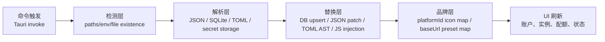
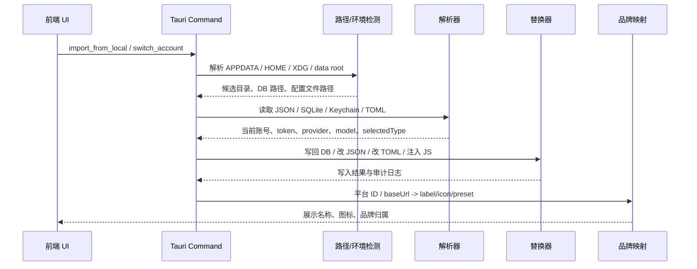

# cockpit-tools 项目深度研究报告

## 执行摘要

`cockpit-tools` 是一个以 **Tauri + Rust 后端 + React 前端** 组织的多平台 AI IDE 账号与多实例管理器。README 明确写出当前支持的主线平台包括 Antigravity IDE、Codex、GitHub Copilot、Windsurf、Kiro、Cursor、Gemini CLI、CodeBuddy、CodeBuddy CN、Qoder、Trae 系列与 Zed；而后端 `src-tauri/src/modules/mod.rs` 进一步显示，它把“账号”“实例”“OAuth”“注入”“路径”“配额”等能力拆成大量按平台命名的模块，例如 `github_copilot_account`、`windsurf_instance`、`gemini_account`、`codex_config_format`、`vscode_inject`、`vscode_paths` 等。Tauri 启动时在 `lib.rs` 里注册大量命令，这些命令再调用各平台模块完成检测、读取、切换和注入。citeturn39view0turn12view0turn14view0turn14view3

从实现方式看，这个项目的“识别工具”并不主要依赖一张统一的“可执行文件名表”，而是更偏向 **按平台和宿主类型选择既定的用户数据目录、状态数据库、JSON/TOML 配置文件以及系统安全存储**。VS Code/Cursor/Windsurf/Qoder/Trae/Zed 这一类通常先确定用户数据根目录，再检查 `state.vscdb`、共享存储数据库、`globalStorage`、`Local State` 或对应产品目录；Gemini CLI 则检查 `~/.gemini` 下的 `oauth_creds.json`、`google_accounts.json`、`settings.json`；Codex 则以自己的 `config.toml` 和模型 catalog 为核心。citeturn46view0turn22view0turn45view1turn36view3turn38view2

配置读取上，项目主要使用 **`serde_json` 解析 JSON、`rusqlite` 读写 SQLite 风格的 `ItemTable`、`toml_edit` 以 TOML AST 方式改写 Codex 配置**。这意味着它不是简单把所有配置当纯文本暴力替换，而是按数据格式分层处理：VS Code 家族走数据库和安全存储；Gemini、CodeBuddy 走结构化 JSON；Codex 走 TOML 文档对象；一些 UI/运行时增强则通过生成 JavaScript 注入脚本，在 Codex 前端页内补充模型列表。citeturn31view0turn33view0turn33view1turn36view0turn38view2

“替换/模板化”方面，项目至少存在四种不同手法。第一种是 **SQLite `INSERT OR REPLACE`**，直接向 VS Code 的 `ItemTable` 写回 `github.auth` 与 `github.copilot-github`；第二种是 **JSON 对象定点改写**，例如 Windsurf 对扩展状态对象写入 `apiServerUrl`、`windsurf.pendingApiKeyMigration` 等字段；第三种是 **TOML AST 编辑**，例如 Codex 在 `Document` 上删除历史遗留的 `[features]` 表并原子写回；第四种是 **字符串模板生成脚本**，例如 Codex 用 `format!` 拼出一段 JS 注入脚本，再通过 DevTools WebSocket 安装到页面中。citeturn33view3turn33view4turn17view1turn37view0turn37view1turn38view2

品牌、图标、账号归属的识别逻辑，则主要是 **metadata-driven 的静态映射**，而不是图像识别。前端 `platformMeta.tsx` 直接用 `platformId -> label/icon` 的 `switch` 映射平台名称和图标；Codex 的外部 API 供应商识别则通过规范化 `baseUrl` 后与预置 `baseUrls` 列表做匹配，得到 preset id。就我审读到的主线代码而言，没有看到“按 MIME 检查图片、计算感知哈希、调用外部 Logo API 做品牌识别”的核心实现；品牌识别更像是“平台 ID + 域名/URL + 预置表”的组合。citeturn25view0turn27view3

## 证据基础与代码范围

这份分析优先使用项目的一手材料：主仓库 `README.md`、关键 Rust 模块源码、前端平台元数据文件、模块历史页，以及一个与 Antigravity 更名相关的 issue。README 说明了项目目标、支持的平台和功能范围；`mod.rs` 给出模块清单；`lib.rs` 给出命令注册与启动组织；其余文件展示了检测、解析、替换与品牌映射的具体实现。citeturn39view0turn12view0turn14view0

一个对“检测”非常重要的旁证来自 issue `#890`：维护者明确区分了“Google Antigravity 2.0”与“Antigravity IDE”，并说明当前切换只支持后者。这意味着项目在品牌/产品识别上不仅要看名字，还要跟踪上游产品线的分叉与重命名；对这种工具来说，检测规则不是一次写死就结束，而是需要跟随上游演变持续维护。citeturn42view0

从提交历史看，`vscode_inject.rs` 这条关键链路至少出现过一次明确的存储路径加固提交：`fix: support VS Code shared Copilot storage`。这说明维护者已经遇到过“同一个平台在不同版本/不同操作系统下状态数据落在不同位置”的问题，并把支持从单一路径扩展到了共享存储数据库等分支。换句话说，工具检测和配置定位在这个项目里是持续演化的，不是静态、理想化的路径假设。citeturn40view0

## 工具识别机制

项目最基础的检测层，是一组 **按操作系统分支的目录候选器**。例如 `src-tauri/src/modules/vscode_paths.rs` 中的 `vscode_data_root_candidates()`，在 Windows 通过 `APPDATA` 构造 `Code` 与 `Code - Insiders`，在 macOS 通过 `~/Library/Application Support`，在 Linux 通过 `XDG_CONFIG_HOME` 或回退到 `~/.config`。这类逻辑本质上就是“环境变量 + 约定目录 + 多候选回退”的检测启发式。citeturn46view0

一个极短但非常关键的代码片段如下，来自 `src-tauri/src/modules/vscode_paths.rs` 第 499–510 行，说明 VS Code 识别首先不是找可执行文件，而是找用户数据根目录候选：`appdata.join("Code"), appdata.join("Code - Insiders")`。citeturn46view0

在 GitHub Copilot 本地导入链路里，检测被推进到“文件存在 + 数据库键存在 + 登录会话匹配”三层。`github_copilot_account.rs` 先用 `resolve_vscode_data_root_for_state_db()` 找到 VS Code 根目录，再构造 `state.vscdb` 以及 Windows 专有的共享存储数据库路径；随后读取 `github.copilot-github` 键获得当前 login，再去 `vscode_inject::read_github_auth_sessions()` 里找 scope 匹配的 GitHub auth session。这里的 heuristic 不是“看到 GitHub 扩展目录就算安装”，而是“看到当前 Copilot login 键，且能把它和 GitHub 会话匹配起来”。citeturn22view0turn22view3turn40view0

Windsurf 的识别方式更像“产品目录 + 安全存储 + 特定扩展状态键”的组合。`windsurf_instance.rs` 在 Windows 用 `%APPDATA%/Windsurf`，在 Linux 用 `~/.config/Windsurf`，而在安全存储解密上，macOS 会调用系统 `security` 命令查找 `"Windsurf Safe Storage"` 项，Linux 则调用 `secret-tool lookup application windsurf|Windsurf` 取得密钥。换言之，Windsurf 不只要识别“应用目录”，还要识别“系统钥匙串里属于这个品牌的项”。这也是用户要求里的“environment checks”与“executable / system command names”在项目中的真实落点：更多出现在钥匙串与系统工具名字，而不是统一的 GUI 可执行文件名常量表。citeturn17view0turn17view1

Cursor 与 Qoder 的多开实例检测则更直白，它们都暴露了“默认用户数据目录”和“Cockpit 自己的实例根目录”。`cursor_instance.rs` 通过 `cursor_account::get_default_cursor_data_dir()` 得到原生 Cursor 用户目录，再把多开实例放到 `~/.antigravity_cockpit/instances/cursor` 或 Windows 下对应目录；`qoder_instance.rs` 直接把默认用户目录指向 `Library/Application Support/Qoder`、`%APPDATA%/Qoder` 或 `~/.config/Qoder`。这表明同一类工具的实例管理实际上依赖“复制/隔离用户目录”而不是重新发现安装包位置。citeturn44view0turn44view3

Gemini CLI 则完全是文件集检测。`gemini_account.rs` 定义了 `.gemini` 家目录以及 `oauth_creds.json`、`google_accounts.json`、`settings.json`、`gemini-credentials.json` 四类核心文件，还给出了 keychain service/account 名称 `gemini-cli-oauth` 与 `main-account`。因此，Gemini 的检测路径是“家目录存在 + JSON 文件存在 + 钥匙串可读”。这和 VS Code 家族的 SQLite/secret-storage 路线相当不同。citeturn45view1turn45view2

Antigravity IDE 的特殊点在于“品牌更名”本身就是检测条件的一部分。issue `#890` 写得很明确：Antigravity 2.0 是一个与原 Antigravity 无关的新应用，而原产品已更名为 Antigravity IDE，当前切换仅支持后者。对这个项目来说，这不是 README 文案问题，而是直接影响目录名、账号注入目标与 UI 品牌映射的识别边界。citeturn42view0

## 配置解析与读取

项目的解析策略是明显分格式分层的。依赖层面，`Cargo.toml` 引入了 `serde`、`serde_json`、`toml_edit`、`rusqlite`、`quick-xml` 等库；在本次直接核实的主链路里，最重要的是 `serde_json`、`rusqlite` 与 `toml_edit`。这三个库分别对应 JSON 文件、VS Code 状态数据库和 Codex TOML 配置。citeturn31view0turn36view0

GitHub Copilot 的解析重点在两类数据。第一类是 SQLite `ItemTable` 里的字符串键值，特别是 `github.copilot-github`；第二类是 GitHub auth sessions 里的 `account.label`、`account.id`、`accessToken` 和 `scopes`。`github_copilot_account.rs` 通过 `read_vscdb_string_item()` 读取数据库记录，然后比对会话 scopes 是否精确等于 `["read:user","user:email","repo","workflow"]`，再选出当前账号的 access token。也就是说，这里读取的不只是“配置文件”，而是一套“状态 DB + 扩展会话 JSON”联合解析器。citeturn22view0turn22view3

相应的底层安全存储解析在 `vscode_inject.rs` 完成。该文件开头的注释把平台加密模型写得很清楚：Windows 读取 `Local State` 的 `os_crypt.encrypted_key` 后走 DPAPI/AES-GCM；macOS 用 Keychain 中的 “Code Safe Storage” 密码走 AES-CBC；Linux 则在 `v10` / `v11` 前缀之间分流，并通过 Secret Service 获取密钥。随后它把 `github.auth` 这一项解码成 Buffer JSON，再进一步解出 session JSON。换句话说，Copilot 不是简单 `read_to_string + JSON.parse`，而是“先解密，再解析”。citeturn33view1turn33view2turn34view1turn34view4

一个非常短的实现片段，来自 `src-tauri/src/modules/vscode_inject.rs` 第 3426–3432 行，可看到它锁定了真正要读取/改写的 secret key：`"vscode.github-authentication"` 与 `"github.auth"`。citeturn34view1

Gemini CLI 的读取链路则完整体现了“多文件拼装账户画像”的思路。`gemini_account.rs` 定义并读取 `oauth_creds.json`、`google_accounts.json`、`settings.json` 与可能位于钥匙串中的 `gemini-credentials.json`；`read_local_oauth_creds_from_path()` 用 `serde_json::from_str::<LocalOauthCreds>` 解析 OAuth 凭证；`read_local_google_accounts_from_path()` 解析 Google 账号列表；`read_local_selected_auth_type_from_path()` 再从 `settings.json` 的 `security.auth.selectedType` 读取当前认证类型。账号是否完整，并不是靠单一文件决定，而是靠多文件合并。citeturn45view1turn45view2

CodeBuddy 的读取更偏向“导入与兼容层”。`codebuddy_account.rs` 的 `import_from_json()` 会先尝试把输入当成单个 `CodebuddyAccount`，再尝试数组，最后退化为 `serde_json::Value` 进入兼容解析路径；在兼容字段层，它会同时接受 `refresh_token` 与 `refreshToken`，并读取 `domain` 等字段。这种处理说明 CodeBuddy 的“解析”不仅包括读官方本地状态，也包括读用户外部导出的不同 JSON 形态。citeturn44view2turn45view4

Codex 的配置读取则明显更“结构化编辑”。`codex_config_format.rs` 使用 `toml_edit::Document` 解析 TOML，关心的顶级 key 明确包括 `features`、`model`、`model_provider`、`model_catalog_json`；同时它还会识别 `[projects.*]` 表头，对非 ASCII、包含 Unicode 转义、或 TOML 解析失败的项目表进行剔除。这里读取的关注点非常清晰：一方面抓模型与供应商配置，另一方面主动清洗可能使解析器失稳的 project section。citeturn36view0turn37view0turn37view4

## 配置替换与模板化

项目最典型的替换方式，是 **对状态数据库做定点写入**。`vscode_inject.rs` 在写 Copilot 切号时，先确保 `ItemTable` 存在，然后对 `github.auth` 与 `github.copilot-github` 做 `INSERT OR REPLACE`。这不是文本替换，而是数据库级 upsert；优点是结构稳定、避免破坏周边字段，代价是需要理解 VS Code 的 secret storage 编码格式。citeturn33view3turn33view4

与之相对应，Windsurf 的切号更像 **JSON 对象补丁**。在 `windsurf_instance.rs` 中，状态对象如果是 `Object`，就会插入 `apiServerUrl`，并依据 token 类型决定写入或删除 `windsurf.pendingApiKeyMigration`；同时注释写得非常直白：`codeium.installationId` 必须存在，否则 Windsurf 的反作弊会把这次切号视为异常。这里的替换策略是“按 key 精准插入/删除”，既不是盲目覆盖整个文件，也不是 AST 重建。citeturn17view1

Codex 是本仓库里最“AST 化”的配置替换示例。`sanitize_codex_config_doc()` 会在 `toml_edit::Document` 上检查 `features` 是否是 table，如果是，就直接 `doc.remove("features")`；`sanitize_codex_config_toml_file()` 再把文档规范化，并通过 `write_codex_config_toml_atomic()` 原子写回，同时连同相邻的 `.bak` 备份一起清洗。这里的中心思想不是“替换某一行字符串”，而是“对 TOML 语法树做最小语义编辑，然后原子落盘”。citeturn37view0turn37view1turn36view3

一个很短但能代表方法论的片段，来自 `src-tauri/src/modules/codex_config_format.rs` 第 1430–1447 行：`let _ = doc.remove(CODEX_FEATURES_KEY);`。这就是典型的 AST 级删除，而不是正则删行。citeturn37view1

不过 Codex 也并非完全抛弃字符串级手法。`codex_config_format.rs` 中的 `remove_project_sections()` 会逐行扫描内容，识别 `[projects.*]` 表头，再按“是否 aggressive / 是否 unsafe header”决定跳过整个 section。这是一个“先文本消毒，再 AST 解析”的混合策略：先用字符串扫描去掉已知危险段，再把剩余内容交给 `toml_edit`。这类设计通常比“纯 AST 一把梭”更耐脏数据。citeturn37view4turn36view3

Codex 还有一种与前几类完全不同的“模板化”手法：**生成 JavaScript 注入脚本**。`codex_model_injector.rs` 先把模型描述列表序列化成 JSON，再通过 `format!` 生成一大段立即执行函数，把模型 descriptor、patch 逻辑和默认值一起嵌进脚本字符串；随后它等待 CDP 页面 WebSocket 就绪，再把脚本安装进页面。这里没有使用 Handlebars、Tera 一类专门模板引擎，而是直接使用 Rust 的 `format!` 作为轻量模板系统。citeturn38view2

Gemini 的替换链路则回到 JSON 结构编辑。`write_local_selected_auth_type_to_path()` 会先读 `settings.json`，若文件损坏则退化为空对象，然后确保存在 `security` 与 `auth` 对象，最终写入 `selectedType`。这是非常典型的“容错 JSON merge-style edit”：即便原文件结构不标准，也会先塑形，再写关键字段。citeturn45view2

## 品牌、账号、Logo 与图标映射

从前端 UI 角度看，平台品牌基本是 **静态枚举映射**。`src/utils/platformMeta.tsx` 里，`getPlatformLabel()` 对 `platformId` 做 `switch`，把 `antigravity` 映射成 `Antigravity`，`github-copilot` 映射成 `GitHub Copilot`，`gemini` 映射成 `Gemini Cli`；`renderPlatformIcon()` 再把这些平台映射到 `RobotIcon`、`CodexIcon`、`Github`、`WindsurfIcon`、`CursorIcon`、`GeminiIcon` 等 React 组件。这个映射是代码内置的，不依赖运行时图像分析。citeturn25view0

一个代表性极短片段如下，来自 `src/utils/platformMeta.tsx` 第 442–448 行：`case 'github-copilot': return 'GitHub Copilot';`。这说明主平台品牌名称是固定表，而不是从 logo 文件反推。citeturn25view0

Codex 的“品牌识别”更有意思一些，因为它还要处理外部 API 供应商。`src/utils/codexProviderPresets.ts` 维护了大量 `preset`，每个 preset 包含 `id`、`name`、`baseUrls`、`website`，有些还带 `apiKeyUrl`；随后 `normalizeCodexProviderBaseUrl()` 把 URL 规整为 `origin + pathname` 的小写形式，再由 `findCodexApiProviderPresetByBaseUrl()` 在预置表中做精确匹配，最后 `resolveCodexApiProviderPresetId()` 产出品牌／提供方 ID。也就是说，这里的品牌判断依赖“域名/路径标准化匹配”，而不是 logo 图片。citeturn27view3

如果把用户要求里的“image/name matching、heuristics、metadata、file paths、MIME checks、hashing、external services”逐项对照，我对主线代码的结论是：**项目强依赖 metadata heuristics，弱依赖 image heuristics**。我在这次直接核实到的主路径里，看到了平台 ID 映射、URL 归一化、配置 key、目录路径、钥匙串服务名、数据库 key；但没有看到以 MIME 类型、图像哈希、外部 logo API 为核心的品牌识别主链路。品牌判断更多像“平台枚举 + provider baseUrl + 预置元数据”，这对桌面工具来说反而更稳定、可测试。citeturn25view0turn27view3

同样值得注意的是，README 的 sponsor 区块虽然出现了第三方服务链接，例如 `apikey.fun` 与 `roxybrowser`，但这属于 README/商业引流，并不是运行时用于 logo 或品牌识别的外部服务调用。因此，如果要严格回答“是否依赖外部品牌服务”，至少在我核实的主品牌映射链路里，答案更接近于“不依赖”。citeturn39view0turn27view3

## 架构与数据流

整体架构可以概括成四层。最外层是 **Tauri 应用壳**，`lib.rs` 用 `tauri::Builder` 组装插件、单实例、深链、通知等能力；中间层是 **commands 层**，Tauri 在 `.invoke_handler(tauri::generate_handler![...])` 中注册 `list_accounts`、`switch_account`、`import_from_local`、`refresh_*` 等命令；再下一层是 **modules 层**，按平台和功能拆分成 `*_account`、`*_instance`、`*_oauth`、`vscode_inject`、`vscode_paths`、`codex_config_format` 等模块；最底层是 **宿主状态层**，也就是本地文件、SQLite DB、Keychain / Secret Service、以及 UI 注入的目标进程。citeturn14view0turn14view3turn12view0

`modules/mod.rs` 是很好的模块地图。它既列出每个平台自己的账号/实例/OAuth 模块，也暴露横切能力，例如 `atomic_write`、`instance_store`、`process`、`quota_cache`、`remote_config`、`webdav_sync`、`vscode_inject` 和 `vscode_paths`。这说明项目并不是“每个平台从头写一遍”，而是把通用能力抽成公共模块，再让平台模块组合使用。citeturn12view0

在实际的数据流里，GitHub Copilot 这条链路最能体现全貌：命令层触发本地导入或切号；`vscode_paths` 解析 VS Code 根目录；`github_copilot_account` 读取 `github.copilot-github` 与 GitHub auth session；`vscode_inject` 解密 `github.auth`、合成新 sessions、再写回 `ItemTable`；最后 UI 刷新账号状态。Windsurf 和 Gemini 只是把“数据源”从 VS Code DB 换成了各自的 JSON/secret storage；Codex 则把“注入目标”换成了配置 TOML 和前端模型列表。citeturn22view0turn22view3turn33view2turn33view4turn17view1turn45view2turn38view2

上图对应的主实现文件分别包括：`lib.rs` 的命令注册；`vscode_paths.rs` 的路径候选；`github_copilot_account.rs`、`gemini_account.rs`、`codex_config_format.rs` 的读取解析；`vscode_inject.rs`、`windsurf_instance.rs`、`codex_model_injector.rs` 的写回与注入；以及 `platformMeta.tsx`、`codexProviderPresets.ts` 的品牌映射。citeturn14view0turn46view0turn22view0turn45view2turn37view0turn33view4turn17view1turn38view2turn25view0turn27view3

## 工具对比表

下表不是按 README 的 15 个显示名称逐个重复同构细节，而是按 **“实现家族”** 比较。这样更贴近源码结构：Trae / TRAE SOLO / CN 变体、Cursor/Qoder/Zed/Kiro 这类多开逻辑通常共用一套“独立 user data dir + 平台专属模块”的范式；CodeBuddy CN 则与 CodeBuddy 在实现形态上是平行分支。citeturn39view0turn12view0

| 工具或家族 | 检测方法 | 关键配置/状态文件 | 解析方式 | 替换方式 | 品牌识别方式 | 主要证据 |
|---|---|---|---|---|---|---|
| GitHub Copilot | 先解析 VS Code data root；再查 `state.vscdb` / Windows shared storage；再读 `github.copilot-github` 与 GitHub auth session | VS Code `ItemTable`，`github.auth` secret，`github.copilot-github` | `rusqlite` 读 `ItemTable`；解密 secret storage；解析 session JSON | `INSERT OR REPLACE` 写 `github.auth` 与 login key | 前端用 `platformId='github-copilot'` 映射名称/图标 | citeturn46view0turn22view0turn22view3turn33view2turn33view4turn25view0 |
| Windsurf | 用 `%APPDATA%/Windsurf`、`~/.config/Windsurf` 等目录；额外检查 Keychain/Secret Service 中 `"Windsurf Safe Storage"` / `windsurf` | 扩展状态对象、safe storage secret | JSON 对象字段读取；系统安全存储解密 | 对状态对象 `insert/remove`，写 `apiServerUrl`、`windsurf.pendingApiKeyMigration` 等 | 前端静态 `WindsurfIcon`；逻辑侧靠扩展 ID / key 命名识别 | citeturn17view0turn17view1turn25view0 |
| Cursor / Qoder / Kiro / Zed / Trae 家族 | 每个平台模块都暴露默认 user data dir；多开实例放到 `.antigravity_cockpit/instances/<tool>`；本质是“路径存在 + 隔离用户目录” | 平台自己的用户目录与实例目录 | 依各平台 account/instance 模块读取；家族上延续 VS Code 风格 | 以复制/隔离 user data dir 为主，配合各自注入逻辑 | 前端按 `platformId` 静态标注图标 | citeturn44view0turn44view3turn12view0turn25view0 |
| Gemini CLI | 检查 `~/.gemini`；读取 `oauth_creds.json`、`google_accounts.json`、`settings.json`、`gemini-credentials.json`；还会查 keychain service | `oauth_creds.json`、`google_accounts.json`、`settings.json` | `serde_json` 解析多份 JSON；从 `security.auth.selectedType` 读认证类型；解析 keychain JSON | JSON merge-style 编辑 `settings.json`，补 `security.auth.selectedType` | 前端静态 `GeminiIcon` | citeturn45view1turn45view2turn25view0 |
| CodeBuddy / CodeBuddy CN | 偏导入兼容型检测：接受单对象、数组、Value；兼容 `refresh_token`/`refreshToken` | JSON 导入内容与账号详情文件 | `serde_json` 多分支解析 | 账号对象字段更新与 upsert | 前端按 `platformId` 静态映射；CN 为并行平台分支 | citeturn45view4turn44view2turn12view0turn25view0 |
| Codex | 以 Codex 自有配置与模型 catalog 为核心；读取 `config.toml` 与 model catalog；运行时还轮询 CDP page target | `config.toml`、model catalog JSON | `toml_edit::Document` 解析 TOML；`serde_json` 解析模型 catalog | TOML AST 删除/规范化/原子写；再用 `format!` 生成 JS 注入脚本并通过 WebSocket 安装 | `baseUrl` 规范化匹配 provider preset；UI 用 `CodexIcon` | citeturn36view0turn36view3turn37view0turn38view2turn27view3turn25view0 |
| Antigravity IDE | 需要区别于新的 “Antigravity 2.0”；检测边界受上游品牌更名影响 | 独立 account / instance / legacy 模块 | 源码显示有 `antigravity_*` 独立模块；本文未逐行展开其内部格式 | 支持独立账号与多实例；主线已明确只支持 Antigravity IDE 切换 | 前端用 `RobotIcon`；issue 明确品牌边界 | citeturn12view0turn39view0turn42view0turn25view0 |

## 扩展与加固建议

如果把这个项目当作“可长期维护的多工具配置编排器”，我最强的建议是把 **检测规则抽成显式 registry**。现在的代码组织已经有 `*_account` / `*_instance` / `*_oauth` 的模块命名规范，但“哪些目录算命中、哪些文件必需、哪些键是当前账号、哪些安全存储服务名可接受”仍大量散落在各模块内部。可以考虑引入一个统一的 `ToolProbe`/`ToolDescriptor` 描述层，把目录候选、必备文件、状态 DB key、密钥服务名、配置写回方式都显式登记，方便测试与热修。之所以这么建议，是因为现有提交历史已经证明这些路径会变，例如 Copilot 需要补 shared storage 支持，Antigravity 还发生过产品线改名。citeturn40view0turn42view0turn12view0

第二个建议是把 **“检测”与“替换”之间增加证据分级**。从当前设计看，很多链路已经做了不错的结构化解析，但还可以更进一步：例如把“只发现目录”“发现目录 + 配置文件”“发现目录 + 配置文件 + 当前账号键”“发现目录 + 可成功写回 + 可成功回读校验”分成不同 confidence level。这样 UI 可以避免把“候选安装”误显示成“已确认可切换实例”。这对 VS Code/Cursor/Windsurf 一类特别重要，因为它们的数据位置和安全存储方案受平台差异影响很大。citeturn46view0turn22view0turn17view0turn33view2

第三个建议是为 **品牌映射增加可回退的 provider fingerprint**。当前 Codex provider 识别很实用，但主要依赖 `baseUrl` 精确规范化匹配；这在同厂商多路径、多 region、多代理反代下会有脆弱性。可考虑在不引入外部服务的前提下，增加 hostname suffix、路径 prefix、响应头签名、或用户手动覆写的多层匹配策略。这样仍然保持目前“metadata-driven”的确定性，同时减少把新代理地址误归为 custom 的概率。citeturn27view3

第四个建议是继续坚持 **结构化编辑优先、文本替换兜底** 的方向。Codex 的 `toml_edit` + 预清洗、Copilot 的 DB upsert、Gemini 的 JSON merge-style edit，都是比纯字符串 `replace()` 更稳健的路线；未来如果要扩展更多工具，最好首先寻找其原生数据结构和可验证 schema，而不是先写正则。当前代码已经在这方面给出了很好的样板。citeturn33view4turn37view0turn45view2

最后，从安全与可观测性角度，我建议把所有写回链路都统一接入 **原子写、备份、副本审计与回读校验**。Codex 这一套已经很接近成熟：会清理只读属性、处理 `.bak`、原子写回、记录 before/after audit；如果能把这种模式下沉为公共组件，并复制到 Gemini/Windsurf/其他 JSON 路线，项目在面对损坏配置、并发切号、异常退出时会更稳。citeturn36view3turn37view1